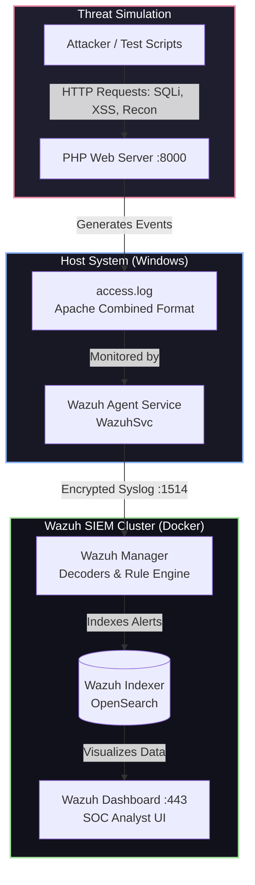

# Real-Time Web Application Threat Detection & SOC Lab

A hands-on Purple Team lab demonstrating end-to-end web attack detection, log telemetry pipeline engineering, and SIEM event correlation using **Wazuh (SIEM/XDR)**, **Docker**, and a lightweight PHP web server.

---
## 📑 Table of Contents
* [Architecture Overview](#architecture-overview)
* [Core Components](#-core-components)
* [Lab Deployment](#-lab-deployment)
* [Active Recon](#active-recon)
* [Initial Access & Exploitation](#initial-access--exploitation)
* [SOC Analyst Investigation Flow](#-soc-analyst-investigation-flow)

---

## Architecture Overview



---

## ⚙️ Core Components

* **SIEM Platform:** Wazuh Manager & OpenSearch Indexer deployed via Docker Compose.
* **Telemetry Agent:** Wazuh Windows Agent `v4.9.0`.
* **Telemetry Standard:** Apache Combined Log Format (`%h %l %u %t "%r" %>s %b "%{Referer}i" "%{User-Agent}i"`).
* **Vulnerable Endpoint:** Custom PHP application with live request telemetry parsing.

---

## 🚀 Lab Deployment

**1. Launch Wazuh Stack (Docker)**
```bash
git clone https://github.com/wazuh/wazuh-docker.git -b v4.9.0 --depth=1
cd wazuh-docker/single-node
docker compose -f generate-indexer-certs.yml run --rm generator
docker compose up -d
```

**2. Configure Wazuh Agent Telemetry**
Add the following block inside `<ossec_config>` in `C:\Program Files (x86)\ossec-agent\ossec.conf`:
```xml
<localfile>
  <location>E:\web-soc-lab\access.log</location>
  <log_format>apache</log_format>
</localfile>
```
Restart the agent service via PowerShell (Administrator):
```powershell
Restart-Service -Name WazuhSvc
```

**3. Start Target Application**
```powershell
cd app/
php -S localhost:8000
```

---

## Active Recon

| Tool Used | Command Used | MITRE ATT&CK | Wazuh Rule ID | Why We Got the Alert |
| :--- | :--- | :--- | :--- | :--- |
| `dirsearch` | `dirsearch -u http://localhost:8000 -e php,html,txt -t 10` | T1595.002 | 31151 | The correlation rule matched rule `31101` (HTTP 4xx errors) repeating more than 14 times within a 90-second window from the same source IP, identifying automated path discovery behavior. |
| `sqlmap` | `sqlmap -u "http://localhost:8000/index.php?id=1" --batch` | T1595.002 | 100050 | The custom regex detection rule matched a known automated vulnerability scanner signature (`sqlmap`) transmitted inside the incoming HTTP `User-Agent` header during active testing. |
---
## Initial Access & Exploitation

| Attack Vector | Payload / Command Used | MITRE ATT&CK | Wazuh Rule ID | Why We Got the Alert |
| :--- | :--- | :--- | :--- | :--- |
| **SQL Injection (UNION-based)** | `curl "http://localhost:8000/index.php?id=1'%20UNION%20SELECT%20null,username,password%20FROM%20users--%20-"` | **T1190** (Exploit Public-Facing Application) | **31106** | The decoder matched an embedded SQL syntax pattern (`UNION SELECT`) inside the HTTP GET query string, and because the server returned an HTTP `200 OK` status instead of rejecting the request, rule `31106` (*A web attack returned code 200*) fired to flag potential successful exploitation. |
| **Path Traversal / LFI** | `curl "http://localhost:8000/index.php?file=../../../../windows/win.ini"` | **T1190** (Exploit Public-Facing Application) / **T1083** (File Discovery) | **31106** | The access log decoder detected dot-dot-slash directory traversal patterns (`../`) targeting an internal operating system configuration file (`win.ini`), while the web server returned an HTTP `200 OK` status code. |
| **Reflected XSS** | `curl "http://localhost:8000/index.php?search=<script>alert('XSS')</script>"` | **T1190** (Exploit Public-Facing Application) / **T1059.007** (JavaScript Execution) | **31106** | The access log decoder identified client-side script injection tags (`<script>`) passed into parameter values, accompanied by a successful HTTP `200 OK` web server response. |
| **Authentication Brute Force** | `for /L %i in (1,1,15) do curl -s -X POST -d "user=admin&pass=wrongpass%i" http://localhost:8000/login.php` | **T1110.001** (Password Guessing) | **31101** | The web server rejected invalid credentials sent via HTTP POST and returned an HTTP `401 Unauthorized` status code (`data.id: 401`), matching rule `31101` for tracking repetitive authentication failures. |


---

## 🔍 SOC Analyst Investigation Flow

1. Open **Wazuh Dashboard** -> **Threat Hunting** -> **Events**.
2. Filter by Agent & Web rules:
   ```text
   rule.groups: "web"
   ```
3. Key fields analyzed during triage:
   * **`data.url`**: Pinpoints injected parameters and payloads.
   * **`data.srcip`**: Identifies source attacker IP.
   * **`rule.mitre.id`**: Correlates the event directly with MITRE ATT&CK tactics.
